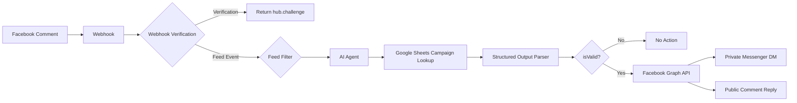

# Facebook Comment to DM AI Automation 🤖

<p align="center">
  <strong>AI-powered Facebook campaign comment automation built with n8n, OpenAI, Google Sheets & Facebook Graph API.</strong>
</p>

<p align="center">
  
  
  
  
</p>

## 🎯 Problem It Solves

Businesses often run Facebook campaigns where users comment things like **“link please,” “send me,” “PDF চাই,” or “material কোথায় পাব?”**. Manually identifying these requests, checking the campaign, finding the correct resource, and sending it through Messenger is repetitive, time-consuming, and difficult to scale.

This project automates that process. It receives Facebook comment events through a webhook, checks the related campaign/resource from Google Sheets, and uses AI to determine whether the user is genuinely requesting the resource or whether the comment is irrelevant, spam, abusive, or promotional.

For a valid request, the workflow automatically sends the resource through Messenger and posts a short public reply. Invalid or irrelevant comments are ignored.

## ✨ What This Automation Does

- 📥 Receives Facebook Page comment events through a webhook
- 🔐 Verifies Facebook webhook requests
- 🔎 Filters incoming feed events
- 🤖 Uses AI to understand comment intent
- 📊 Looks up campaign/resource data in Google Sheets using Post ID
- 🧠 Validates the request with structured AI output
- 💬 Sends the requested resource through Facebook Messenger
- 📣 Posts a short public reply such as **“আপনার ইনবক্স চেক করুন!”**
- 🚫 Ignores spam, abusive, promotional, irrelevant, or unmatched comments
- 🛡️ Prevents the AI from inventing resource information

## 🏗️ Architecture



## 🔄 How It Works

### 1. Facebook Webhook

The workflow receives Facebook Page events through an n8n Webhook node.

### 2. Webhook Verification

Facebook verification is handled with `hub.mode`, `hub.verify_token`, and `hub.challenge`. The workflow validates the configured token and returns the exact challenge value when verification succeeds.

### 3. Feed Event Filtering

Only relevant `feed` events continue to the AI processing branch.

### 4. AI Intent Understanding

The AI Agent reads the comment and determines whether the user is genuinely asking for the campaign resource. It also rejects irrelevant, spam, abusive, promotional, or unsupported comments.

### 5. Campaign Lookup

Google Sheets is used as the campaign data source. The workflow looks up the campaign using the Facebook Post ID and retrieves the corresponding campaign/resource information.

### 6. Structured AI Output

The AI must return a predictable structure:

```json
{
  "isValid": true,
  "dmMessage": "...",
  "publicReply": "..."
}
```

The Structured Output Parser makes the downstream workflow more reliable by enforcing the required fields.

### 7. Automatic Response

If `isValid` is `true`:

- The requested resource is sent privately through Messenger.
- A short public reply is posted on the original comment.

If `isValid` is `false`, no message is sent.

## 🧠 Why AI Is Used

AI is used only where language understanding is required: interpreting the user's comment, deciding whether the user genuinely wants the campaign resource, and generating natural Bengali responses.

The rest of the workflow—webhook handling, Google Sheets lookup, conditions, routing, and Facebook Graph API requests—is deterministic automation.

## 🛠️ Tech Stack

| Technology | Role |
|---|---|
| **n8n** | Workflow orchestration |
| **OpenAI GPT-5-mini** | Intent classification & response generation |
| **Google Sheets** | Campaign/resource lookup |
| **Facebook Graph API** | Messenger & public comment actions |
| **Webhooks** | Facebook event ingestion |
| **Structured Output Parser** | Reliable AI output validation |

## 📁 Repository Structure

```text
Facebook-Comment-to-DM-AI-Automation/
│
├── README.md
├── n8n-workflow.json
└── .gitignore
```

## 📦 Workflow File

The complete **sanitized n8n workflow** is available here:

**[`n8n-workflow.json`](./n8n-workflow.json)**

The JSON is based on the workflow documented in the project PDF. Credentials and private identifiers have been removed/replaced with placeholders before publishing.

### Import into n8n

1. Open n8n.
2. Create or open a workflow.
3. Select **Import from File**.
4. Choose `n8n-workflow.json`.
5. Configure your own credentials and IDs.
6. Replace placeholders such as `YOUR_VERIFY_TOKEN`, `YOUR_GOOGLE_SHEET_ID`, and `YOUR_SHEET_ID`.
7. Configure the Facebook Page and webhook settings.

> ⚠️ The published JSON is intentionally sanitized. You must configure your own credentials before running it.

## 🔐 Security

**Never commit real credentials to GitHub.**

Do not publish:

- Facebook Page access tokens
- OpenAI API keys
- Google OAuth credentials
- Webhook verification secrets
- Private spreadsheet identifiers
- n8n credential IDs

Use n8n's credential system or environment variables for sensitive configuration.

## 📈 Business Value

This automation can help businesses:

- Reduce manual Facebook comment monitoring
- Deliver campaign resources faster
- Handle high-volume campaign requests consistently
- Filter low-value and spam interactions automatically
- Improve customer response time
- Scale campaign engagement without increasing manual support workload

## 🚀 Future Improvements

- Add API retry and error-handling branches
- Add execution logging and monitoring
- Add campaign analytics dashboard
- Support multiple campaign/resource types
- Add multilingual responses
- Add automated workflow tests
- Add production-grade secret management

## 👨‍💻 Author

**Angkon Biswas**  
AI Automation Engineer | AI Agents | Workflow Automation

[GitHub](https://github.com/angkonbiswas)

---

⭐ If this project is useful, consider giving the repository a star.
